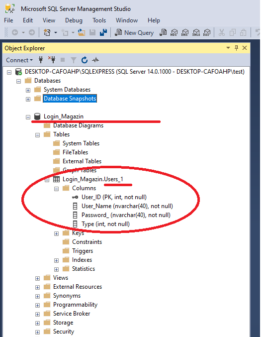

# Interfata-simpla-de-Login-folosind-EF6

  Proiectul de fata prezinta in mod practic etapele realizarii si utilizarii unui model Entity Framework pentru o aplicatie software (in C#) ce utilizeaza o legatura la o baza de date.

  Modelul de programare centrat pe baza de date, presupune ca baza de date este creata si apoi se genereaza modelul logic ce contine tipurile folosite in logica aplicatiei.
Acest lucru se face folosind mediul de dezvoltare VStudio. 

Baza de date in exemplul nostru Login_Magazin este cea mai simpla cu putinta, continand un singur tabel denumit Users_1.




Scriptul pentru creearea bazei de date este:
```
USE [Login_Magazin]
GO

/****** Object:  Table [Login_Magazin].[Users_1]    Script Date: 01/03/2021 22:00:07 ******/
SET ANSI_NULLS ON
GO

SET QUOTED_IDENTIFIER ON
GO

CREATE TABLE [Login_Magazin].[Users_1](
	[User_ID] [int] IDENTITY(1,1) NOT NULL,
	[User_Name] [nvarchar](40) NOT NULL,
	[Password_] [nvarchar](40) NOT NULL,
	[Type] [int] NOT NULL,
PRIMARY KEY CLUSTERED 
(
	[User_ID] ASC
)WITH (PAD_INDEX = OFF, STATISTICS_NORECOMPUTE = OFF, IGNORE_DUP_KEY = OFF, ALLOW_ROW_LOCKS = ON, ALLOW_PAGE_LOCKS = ON) ON [PRIMARY]
) ON [PRIMARY]
GO
```

